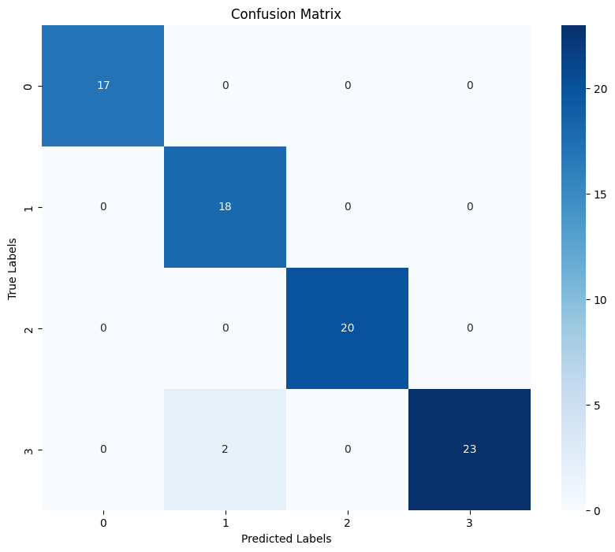

# arduino-tiny-ml
The repository contains a gesture recognition system implemented on Arduino nano 33 ble sense board using a neural network based on gyroscope and accelerometer inputs. It uses:
- Google Colab for training a TensorFlow Lite neural network and deploy the arduino header file containing the model.
- Arduino IDE for collecting the data in .csv files for the training and the inference.

# Training data collection

The arduino project [*input_capture*](arduino/input_capture/input_capture.ino) contains the source code that collects features from the gyroscope and accelerometer in widows of 128 samples:
- Mean value
- Standard deviation
- Root mean square
- Minimum value
- Maximum value
- Power Spectral Density 

These measurements are computed directly in the arduino microcontroller and saved in *.csv* files for seprate gestures, ready for the actual neural network training in google colab.
In our implementation, we considered four types of movements: 
- Rest (nothing)
- Shake (a left-right movement)
- Up-Down
- Circle 

The measurements are stored in the [training_data](training_data) folder.

> [!NOTE]
> During training and inference, the Arduino board is handled with the usb port facing upwards and the chips of the board facing right. 

# Neural Network training 
The [colab notebook](GesturesRecognitionTraining.ipynb) contains the steps for the creation and validation of the model automatically using its confusion matrix. 

The results that we obtained indicates a low amount of false positives/false negatives and good accuracy levels. 


```
Total accuracy: 0.975

Per class specs: 
-> Rest
	 accuracy 1.0
	 true positive rate 1.0
	 true negative rate 1.0
	 positive predictive value 1.0
	 f1 score 1.0 
-> Left-right
	 accuracy 0.975
	 true positive rate 1.0
	 true negative rate 1.0
	 positive predictive value 0.9
	 f1 score 0.9473684210526315 
-> Down-Up
	 accuracy 1.0
	 true positive rate 1.0
	 true negative rate 1.0
	 positive predictive value 1.0
	 f1 score 1.0 
-> Circle
	 accuracy 0.975
	 true positive rate 0.92
	 true negative rate 0.9649122807017544
	 positive predictive value 1.0
	 f1 score 0.9583333333333334 
```

# Inference 
In order to evaluate the model in real time we provided an arduino project [*training_data*](arduino/inference/inference.ino) with the source code for the inference. 


